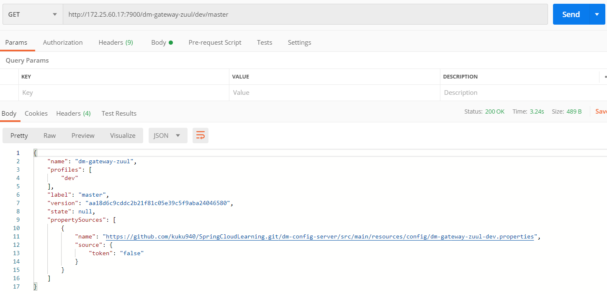

在Configuration -> Override paramter中添加`github.username`和`github.password`参数，
启动dm-config-server项目。

通过postman访问[http://172.25.60.17:7900/dm-gateway-zuul/dev](http://172.25.60.17:7900/dm-gateway-zuul/dev)获取到git上
的[dm-gateway-zuul-dev.properties](./src/main/resources/config/dm-gateway-zuul-dev.properties)信息，
默认获取的master分支的信息，如果想获取其他分支信息使用[http://172.25.60.17:7900/dm-gateway-zuul/dev/BRANCH_NAME]。

