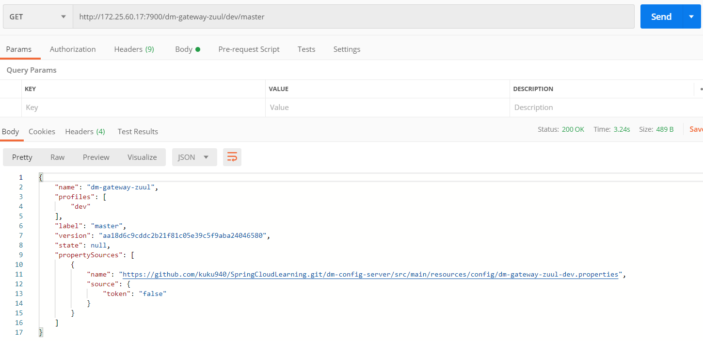
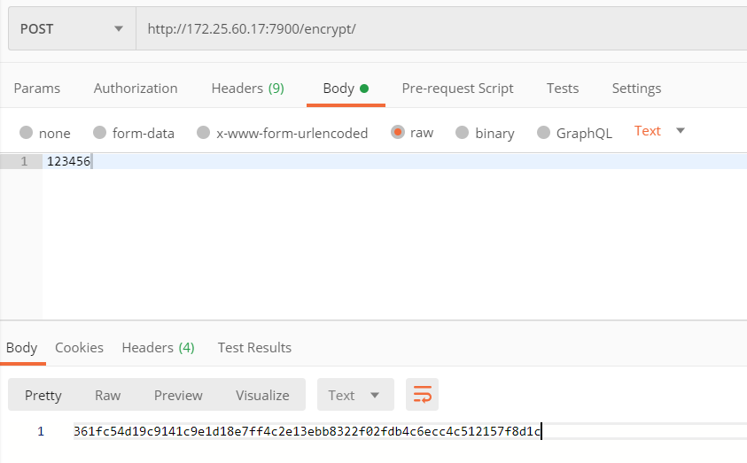
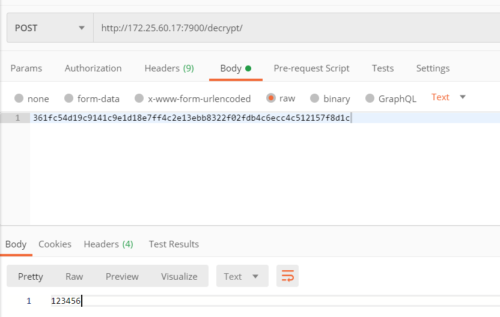

### 项目启动步骤

在Configuration -> Override paramter中添加`github.username`和`github.password`参数，
启动dm-config-server项目。

通过postman访问[http://172.25.60.17:7900/dm-gateway-zuul/dev](http://172.25.60.17:7900/dm-gateway-zuul/dev)获取到git上
的[dm-gateway-zuul-dev.properties](./src/main/resources/config/dm-gateway-zuul-dev.properties)信息，
默认获取的master分支的信息，如果想获取其他分支信息使用[http://172.25.60.17:7900/dm-gateway-zuul/dev/BRANCH_NAME]。



### SpringCloudConfig加密

**1. 升级JCE环境**  
下载[javase-jce8](https://www.oracle.com/java/technologies/javase-jce8-downloads.html)，
解压拷贝到`JDK/jre/lib/security`目录覆盖文件，会出现invalid key size错误
（还未下载JCE之前生成的key位数不符合Spring Cloud Config 长度限制（太短））

**2. 配置Config**  
在[bootstrap.yml](./src/main/resources/bootstrap.yml)中添加配置
```yaml
encrypt:
  key: ABC123
```
访问[http://172.25.60.17:7900/encrypt/status](http://172.25.60.17:7900/encrypt/status)可以看到
```json
{
    "status": "OK"
}
```

**3. 加解密**  

加密信息，访问[http://localhost:9000/encrypt/](http://localhost:9000/encrypt/)，
选择post方式，在body中选择raw格式，并选择text格式


解密信息，访问[http://localhost:9000/decrypt/](http://localhost:9000/encrypt/)，
选择post方式，在body中选择raw格式，并选择text格式


接着将加密信息添加到配置中，在加密信息前添加`{cipher}`前缀解析时会被认为是加密串而自动解析。
```yaml
security:
  user:
    name: root
    password: '{cipher}361fc54d19c9141c9e1d18e7ff4c2e13ebb8322f02fdb4c6ecc4c512157f8d1c'
```