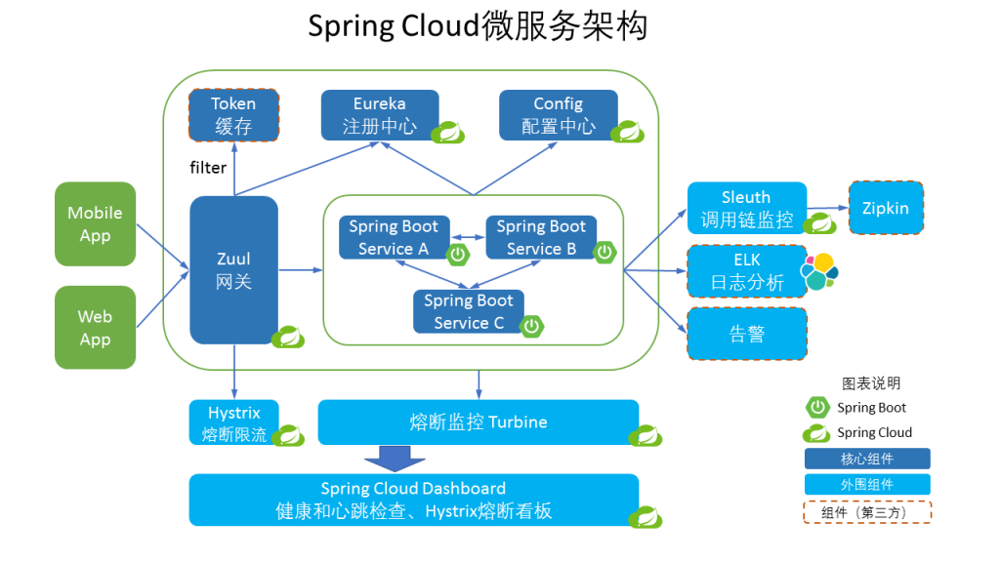
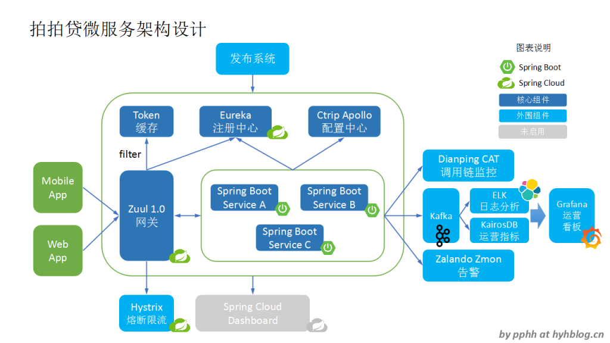
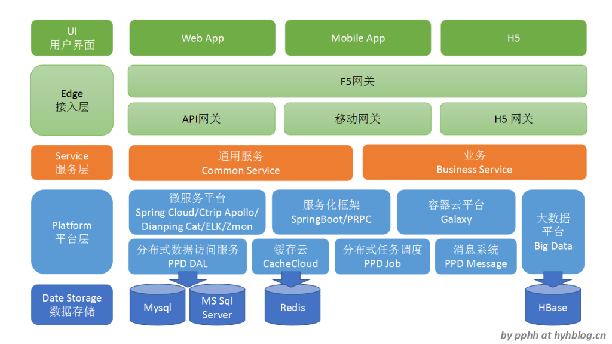

## 微服务架构
* 网关Zuul - 提供服务路由，负载均衡，访问安全控制，熔断限流；
* 注册中心Eureka - 服务的注册与发现
* 配置中心Config - 应用环境配置（搭配Git使用）
* 微服务SpringBoot - 应用服务开关
* 服务调用Feign -  各个微服务之间的服务调用
* 负载均衡Ribbon - 请求的负载均衡
* 容错限流Hystrix - 服务端的容错限流
* 调用链监控Sleth - 通过日志跟踪调用链
* 日志收集BLK - 日志收集及分析
* 监控看板SpringCloudDashboard -  应用健康状态、心跳检查、熔断限流看板
* 流量监控Turbine - 流量监控、熔断限流监控
* 告警：健康和熔断告警

图中日志分析和告警两个模块组件，Spring Cloud尚未涉及相关组件，
需要对接第三方所提供的组件模块。图中选用了ELK和Zalando Zmon。

## 拍拍贷微服务实践

主要组件模块的功能如下：

* 网关Zuul 1.0：提供服务路由、负载均衡、访问安全控制、熔断限流；
* 注册中心Eureka：服务注册和发现；
* 配置中心Ctrip Apollo：应用环境配置；
* 微服务Spring Boot：应用服务开发；
* 发布系统：通过网关实现应用服务的上下线、灰度发布、蓝绿发布；
* 调用链监控Dianping CAT：应用服务的监控埋点；
* 数据收集器Kafka：进行ELK的日志分析，收集运营Metrics到KairosDB；
* 运营指标KairosDB：存储相关的运营指标，包括业务、系统和运维指标，比如用户的访问量、消息的消费吞吐量、zabbix的运维监控数据等；
* 运营看板Grafana：对接ELK/KairosDB/Zabbix，展现数据看板；
* 告警Zalando Zmon：健康和熔断告警。

**与SpringCloud架构对比**
1. 添加发布系统，对接注册中心和网关，实现微服务实例的无缝上下线，实现灰度发布要求，为微服务的持续交付打下基础；
2. 添加ELK日志分析，完善监控告警，通过Grafana提供运营看板，确保微服务运营的快速、简单和稳定。
在Spring Cloud技术体系中，其运营和监控是短板，ELK和Grafana作为业界流行的日志分析和运营看板组件，具有高可扩展性。
3. 内部应用服务调用并未选择直连模式，而是通过服务域名走网关，简单可靠，其适合当前拍拍贷的业务运营需求。

## 拍拍贷逻辑架构

从上到下，分别有，
* UI用户界面：提供Web应用和前端页面、移动应用、H5页面，以便于用户各个渠道的访问
* Edge接入层：这一层承接外部所有用户的访问流量，负载均衡，并进行HTTPS的卸载，校验用户请求的合法性。
同时，三大网关（API、移动、H5）还承接内部应用服务域名的调用访问流量。
* Service服务层：主要的业务逻辑应用服务层
* Platform平台层：包括各大Java服务中间件，微服务开发框架和平台，
支撑整个业务服务应用的开发和运营。
* Data Storage数据存储：数据存储层，主要包括三种：关系型数据库的MySql/MS Sql Server
（目前逐渐从MS Sql Server往MySql迁移），缓存Redis，大数据的HBase。